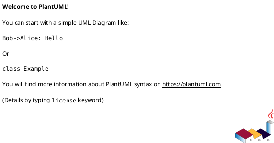
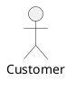
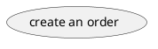
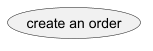
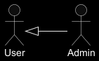
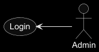

# UML. Навички створення Use-Case діаграм

## 0 - налаштувати IDE
Встановлення плагіна в IntelliJ IDEA
Відкрийте IntelliJ IDEA.
Перейдіть у налаштування: File -> Settings (на macOS: IntelliJ IDEA -> Settings).
У лівому меню оберіть розділ Plugins.
Переконайтеся, що обрано вкладку Marketplace зверху.
У рядку пошуку введіть PlantUML.
Знайдіть плагін PlantUML Integration та натисніть Install.
Після завершення натисніть Restart IDE. 

## 1. Локальні зміни.

- Створити на вашому локальному диску вашу персональну теку (наприклад: `LB-2\MaxVoronoy`)
- За допомогою правої мишки створить Plant-UML файл. Наприклад `LB-2\MaxVoronoy\use-case.puml`. Плагін одразу створює
певний зміст там, можете сміливо видалити все між першою та останньою стрічкою, залиште лише:

## 2. Зміст роботи
Описати за допомогою use-case діаграми роботу сервіса замовлення піци. АБО (!) готель для перетримки котів.

### Актори 

Визначити які актори в нас є (наприклад: замовник, доставка, повар...) (або! ветерінар, cat-sitter ...)

### Варіанти використання (use-case)
Описати які дії вміє робити ваш сервіс, наприклад:
- create an order
- customize a pizza
- replace unavailable ingredients
- cancel an order
- track delivery

### Додати стрілки які описують всі залежності

Деталі стрілок можна прочитати на сайті PlantUML: https://plantuml.com/use-case-diagram
<table>
<tr>
<th>&nbsp;</th>
<th>arrow</th>
<th>PlantUML code</th>
</tr>
<tr>
    <td>
    </td>
    <td>Inherit</td>
    <td> <pre><code>
@startuml
:Admin:
User <|-- Admin
@enduml
</code></pre> 
    </td>
</tr>
<tr>
    <td></td>
    <td>Use</td>
    <td>
<pre><code>
@startuml
:Admin:
(Login) <-- Admin
@enduml
</code></pre>
    </td>
</tr>
<tr>
    <td></td>
    <td>Association (Depends)</td>
    <td>
<pre><code>
@startuml
(Login) <.. (Authentication)
@enduml
</code></pre>
    </td>
</tr>
</table>

## 3. Зробити зміни доступними для загалу

На цей момент ви маєте 1 новий файл (`LB-2\MaxVoronoy\use-case.puml`) 

- За допомогою середовища зробіть commit цьому файлу
Обов'язково опішить коментар, що зроблено.

- Перевірити актуальність вашого локального репозитарію  

Треба впевнитись, що ваші зміни не конфліктують з віддаленими, для цього ще раз виконуємо команду `pull` 
(дивись попередню лабу).

- Перемістити локальні зміни на віддалений репозитарій.
Спробувати виконати команду `push` (конфліктів скоріш за все не повинно бути).
